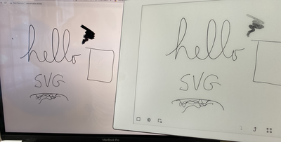

# webserver

a trivial webserver that serves the current page in SVG

build the utility for your remarkable and copy it:

```shell
GOARCH=arm GOOS=linux go build -o watcher.arm 
scp watcher.arm remarkable:
```

Then launch it:

```shell
ssh remarkable "./watcher.arm"
```

and go to `http://localhost:8080` of get the picture `curl http://localhost:8080/svg`



